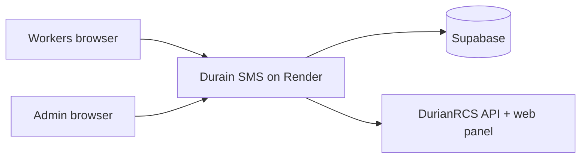

# Deploying Durain SMS for your team

This guide is for **whoever sets up the app** — you deploy once on Render, connect Supabase for logins, link your DurianRCS account, then give workers their own usernames. Workers only need the live URL and their credentials; they do not need Git, Supabase, or Render access.

For local development on a PC, see **[README.md](./README.md)**.

---

## What you are deploying

| Piece | Role |
|--------|------|
| **This app (Next.js on Render)** | Web UI, Durian API proxy, admin dashboard |
| **Supabase** | Stores site logins (`site_users`), SMS stats, admin “lock” settings |
| **DurianRCS** | Real SMS numbers, balance, countries, service catalog |



**Features after setup:**

- Multi-user login (1 admin + up to 10 workers)
- Admin dashboard at `/admin` (stats, user management, lock service/country for everyone)
- Service search (~2,600+ names from Durian web panel)
- Optional cron to wake the server and refresh the catalog

---

## Before you start (checklist)

Create or have ready:

| # | Item | Link |
|---|------|------|
| 1 | **GitHub account** | [github.com](https://github.com) |
| 2 | **Render account** | [render.com](https://render.com) |
| 3 | **Supabase account** (free tier) | [supabase.com](https://supabase.com) |
| 4 | **DurianRCS account** with API key + web panel password | Your provider |

Collect from DurianRCS:

| Credential | Used for |
|------------|----------|
| Username | `DURIAN_USERNAME` |
| API key | `DURIAN_API_KEY` |
| Web panel password | `DURIAN_WEB_PASSWORD`, `/panel-refresh` |

Generate on your machine (any password generator):

| Secret | Used for |
|--------|----------|
| Long random string (32+ chars) | `SITE_AUTH_SECRET` |
| Long random string (optional) | `CRON_SECRET` |

---

## Part 1 — Supabase (database)

Do this **once per deployment**. Every Render instance that shares the same Supabase project shares the same users and stats.

### 1.1 Create a project

1. Log in at [supabase.com](https://supabase.com).
2. **New project** → pick a name and region → set a **database password** (save it; you rarely need it for this app).
3. Wait until the project is **Active**.

### 1.2 Run the schema

1. Open **SQL Editor** → **New query**.
2. Copy the full contents of [`supabase/schema.sql`](./supabase/schema.sql) from this repo.
3. Paste and click **Run**.
4. If Supabase warns about RLS, choose **Run without RLS** (the schema disables RLS on these tables; the app uses the service key server-side only).

You should have three tables: `site_users`, `sms_tracking`, `site_settings`.

### 1.3 Get API credentials

1. Go to **Project Settings** → **API** (or **API Keys**).
2. Copy **Project URL** → you will set `SUPABASE_URL`.
   - Correct: `https://abcdefghij.supabase.co`
   - Wrong: `https://abcdefghij.supabase.co/rest/v1/` ← do **not** include `/rest/v1/`
3. Copy the **service_role** key (legacy) or a full **secret** API key.
   - Use **service_role** / **secret** on Render (server only).
   - Do **not** use the publishable/anon key for `SUPABASE_SERVICE_KEY`.

**Legacy keys:** Settings → API → **Legacy anon, service_role API keys** → Reveal **service_role**.

---

## Part 2 — GitHub (source code)

### 2.1 Put the code on GitHub

**Option A — you own the repo**

```bash
git clone https://github.com/YOUR_ORG/durain-sms.git
cd durain-sms
```

**Option B — fork for a new team**

Fork the repo to your GitHub account (or create a new private repo and push this code).

**Important:** Never commit `.env.local`. It is gitignored.

### 2.2 Branch to deploy

Render should deploy **`main`** (or your default branch). Push all changes there before connecting Render.

---

## Part 3 — Render (hosting)

### 3.1 Create the web service

1. [dashboard.render.com](https://dashboard.render.com) → **New +** → **Web Service**.
2. Connect your GitHub account and select the **Durain SMS** repository.
3. Configure:

| Field | Value |
|--------|--------|
| **Name** | e.g. `durain-sms` |
| **Region** | Closest to your users |
| **Branch** | `main` |
| **Runtime** | Node |
| **Build Command** | `npm install && npm run build` |
| **Start Command** | `npm start` |
| **Instance type** | Free (or paid if you need no sleep) |

4. Do **not** deploy yet if you can add env vars first (or deploy once, then fix env and redeploy).

### 3.2 Environment variables

Open **Environment** and add every **required** variable below. Use **real values**; Render masks secrets after save.

#### Required — Supabase

| Key | Example | Notes |
|-----|---------|--------|
| `SUPABASE_URL` | `https://xxxxx.supabase.co` | Project URL only, no path suffix |
| `SUPABASE_SERVICE_KEY` | `eyJhbGciOiJIUzI1NiIs...` (long JWT) | **service_role**, not anon |

#### Required — site sessions

| Key | Example | Notes |
|-----|---------|--------|
| `SITE_AUTH_SECRET` | `a1b2c3...` (32+ random chars) | Signs login cookies; also used by `/panel-refresh` |

#### Recommended — first admin (login)

| Key | Example | Notes |
|-----|---------|--------|
| `SITE_AUTH_USERNAME` | `admin` or your name | Used to seed/sync admin in `site_users` |
| `SITE_AUTH_PASSWORD` | strong password | **This is what you type on the login page** (stored in Supabase) |

On first boot, if `site_users` is empty, the app creates one admin from `SITE_AUTH_*`. If the table already has users, login uses **Supabase only** — env vars alone do not change the password unless you update the row in Supabase or use **Admin → User Management**.

#### Required — DurianRCS

| Key | Example | Notes |
|-----|---------|--------|
| `DURIAN_USERNAME` | your Durian login | |
| `DURIAN_API_KEY` | from Durian dashboard | |
| `DURIAN_WEB_PASSWORD` | web panel password | For `/panel-refresh` |

#### Recommended — Durian panel catalog (service names)

| Key | Value | Notes |
|-----|--------|--------|
| `DURIAN_USE_DISK_PANEL_COOKIE` | `1` | Prefer session saved on server via `/panel-refresh` |
| `DURIAN_SESSION_COOKIE` | *(optional)* | From PC: `npm run export-panel-cookie` |

Leave `DURIAN_SESSION_COOKIE` empty if you will use **`/panel-refresh`** on the live site (see Part 5).

#### Optional

| Key | Default | Notes |
|-----|---------|--------|
| `DURIAN_AUTO_SYNC_MINUTES` | `30` | Background catalog refresh |
| `CRON_SECRET` | — | For `/api/cron/sync` (wake + sync) |
| `NODE_VERSION` | `22` | Set in `render.yaml` if using blueprint |

### 3.3 Deploy

Click **Save, rebuild, and deploy** (or **Manual Deploy** → **Deploy latest commit**).

First build often takes **3–8 minutes**. Watch **Logs** for `Ready` / listening on port.

Your URL will look like: `https://durain-sms.onrender.com`

---

## Part 4 — Verify the deployment

### 4.1 Login

1. Open `https://YOUR-APP.onrender.com/login`.
2. Sign in with **`SITE_AUTH_USERNAME`** and **`SITE_AUTH_PASSWORD`** from Render (if you set them and ran schema before first boot).

**If login fails with “Invalid username or password”:**

| Check | Action |
|--------|--------|
| Wrong Supabase project | `SUPABASE_URL` + `SUPABASE_SERVICE_KEY` must match the project where you ran `schema.sql` |
| Wrong URL format | `SUPABASE_URL` must **not** end with `/rest/v1/` |
| Wrong API key | Use **service_role** JWT, not publishable/anon |
| Password mismatch | In Supabase **Table Editor** → `site_users` → edit `password` to match what you type, or set admin password in `/admin` after logging in with defaults |
| Default accounts | If you never set `SITE_AUTH_*`, try `admin` / `Admin@2024` once, then change password in **Admin** |

### 4.2 Admin dashboard

1. After login, open the **shield** icon or go to `/admin`.
2. If you are not admin, your user’s `role` in `site_users` must be `admin`.

---

## Part 5 — Durian panel session (service list)

The app needs a **Durian web panel** session to load real service names (Microsoft, Amazon, etc.). API key alone is not enough for the full catalog.

### Option A — From a phone or any browser (no PC)

Best for ongoing ops.

1. Sign in to your live site.
2. Open **`/panel-refresh`** (or footer link **Renew Durian panel session**).
3. Enter the captcha → **Link Durian panel**.
4. On Render, set `DURIAN_USE_DISK_PANEL_COOKIE=1` and redeploy if not already set.

Repeat when the catalog stops updating or sync returns HTML/session errors. **After each new deploy** on Render free tier, disk may be empty — run `/panel-refresh` once again.

### Option B — From a PC (one-time cookie in env)

```bash
npm install
# copy .env.example → .env.local and fill DURIAN_* + SITE_AUTH_*
npm run panel-login
npm run export-panel-cookie
```

Paste the printed line into Render as **`DURIAN_SESSION_COOKIE`**.

### 5.1 Sync services

1. On the home page, tap **Sync services from Durian**.
2. First sync can take **1–2 minutes**; wait for the count to appear.
3. In **Admin → Set lock**, you can search services and countries (requires sync + panel session).

---

## Part 6 — Set up your team

### 6.1 Create worker accounts

1. Sign in as **admin** → `/admin`.
2. **User Management** → add users (role **user**).
3. Maximum **10 worker** accounts; unlimited admins if you add more admin rows manually in Supabase.

Share with each worker:

- App URL: `https://YOUR-APP.onrender.com`
- Their **username** and **password** (from admin; not `SITE_AUTH_*` on Render unless they are the admin).

### 6.2 Lock service & country (optional)

In **Admin → Default Service & Country**:

1. Click **Set lock** or **Change**.
2. Search for a service → click to select.
3. Search for a country → pick from the list.
4. **Apply lock** — all workers then use that service/country only.

### 6.3 What workers see

- Home: get numbers, SMS codes, balance
- No access to `/admin` unless their role is `admin`
- If lock is active, service/country pickers are fixed

---

## Part 7 — Keep the app awake (optional)

Render **free** tier sleeps after ~15 minutes idle. First visit after sleep can take **30–60 seconds**.

### External cron

1. Set `CRON_SECRET` on Render to a long random string.
2. Schedule a GET request every **6–14 minutes** to:

```text
https://YOUR-APP.onrender.com/api/cron/sync?secret=YOUR_CRON_SECRET
```

Or header: `Authorization: Bearer YOUR_CRON_SECRET`

Free schedulers: [cron-job.org](https://cron-job.org), [UptimeRobot](https://uptimerobot.com).

**Note:** A bare URL without `secret` returns **401** — that is expected.

---

## Part 8 — Handoff document (copy for your team)

You can send something like this to workers:

---

**Durain SMS — access**

- **URL:** `https://YOUR-APP.onrender.com`
- **Your username:** *(from admin)*
- **Your password:** *(from admin)*

**How to use:** Sign in → search a service → choose country → Get Number → copy SMS code.

**Problems?** Contact admin. Do not share your password.

---

**For admins only**

- Admin panel: `https://YOUR-APP.onrender.com/admin`
- Renew Durian catalog: sign in → `/panel-refresh` → captcha → Link
- Empty service list: **Sync services from Durian** on home page

---

## Part 9 — Updates and maintenance

| Task | How |
|------|-----|
| Deploy new code | Push to `main` → Render auto-deploys (or Manual Deploy) |
| Change env vars | Render → Environment → Save → redeploy |
| Rotate site password | Admin → edit user, or Supabase `site_users` |
| Rotate Durian account | Update all `DURIAN_*` on Render, clear panel session, `/panel-refresh`, sync services |
| New Supabase project | New project + run `schema.sql` + update Render env (users do not migrate automatically) |

---

## Environment variables (full reference)

See also [`.env.example`](./.env.example) and [README.md](./README.md#environment-variables-reference).

| Variable | Required on Render | Description |
|----------|-------------------|-------------|
| `SUPABASE_URL` | Yes | Supabase project URL (no `/rest/v1/`) |
| `SUPABASE_SERVICE_KEY` | Yes | service_role or secret key |
| `SITE_AUTH_SECRET` | Yes | Session signing (32+ chars) |
| `SITE_AUTH_USERNAME` | Recommended | Admin username seed/sync |
| `SITE_AUTH_PASSWORD` | Recommended | Admin password (login + Supabase) |
| `DURIAN_USERNAME` | Yes | DurianRCS username |
| `DURIAN_API_KEY` | Yes | Durian API key |
| `DURIAN_WEB_PASSWORD` | Yes | Web panel password |
| `DURIAN_SESSION_COOKIE` | Optional* | Panel cookie string |
| `DURIAN_USE_DISK_PANEL_COOKIE` | Recommended | `1` = prefer `/panel-refresh` session on disk |
| `DURIAN_AUTO_SYNC_MINUTES` | No | Default `30` |
| `CRON_SECRET` | No | Cron auth for `/api/cron/sync` |

\*Optional if you use `/panel-refresh` with `DURIAN_USE_DISK_PANEL_COOKIE=1`.

---

## Troubleshooting

| Problem | Likely cause | Fix |
|---------|----------------|-----|
| **Invalid username or password** | Supabase env wrong or user row mismatch | Fix `SUPABASE_URL` / `SUPABASE_SERVICE_KEY`; check `site_users` in Table Editor |
| **Login database unavailable** | Missing/invalid Supabase env | Set both Supabase vars; redeploy |
| **403 on /admin** | User is not admin | Set `role` = `admin` in `site_users` |
| **Empty service search** | No panel session | `/panel-refresh` or `DURIAN_SESSION_COOKIE`; then **Sync services** |
| **“Project N” generic names** | Catalog not from panel | Same as above |
| **Admin lock search empty** | Services not synced | Sync services; wait 1–2 min |
| **Countries empty / Get Number disabled** | API/balance/stock | Check `DURIAN_API_KEY`, Durian balance, pick service with stock |
| **HTML instead of JSON / panel errors** | Expired panel cookie | `/panel-refresh` again |
| **Very slow first load** | Render cold start | Wait 60s or use cron ping |
| **cron 401** | Missing secret | Add `?secret=` or `Authorization: Bearer` |
| **503 on sync** | Durian throttling | Wait 1 min; retry; production uses sequential panel fetch |

---

## Security checklist

- Use a **private** GitHub repository.
- Use strong, unique `SITE_AUTH_PASSWORD` and `SITE_AUTH_SECRET`.
- Never commit `.env.local` or paste secrets in chat/screenshots.
- Only share **worker** logins with workers; keep Render and Supabase access to operators.
- `SUPABASE_SERVICE_KEY` bypasses RLS — server-only, never in the browser.
- Rotate Durian API key and Supabase service role if they were ever exposed.
- Change default `admin` / `Admin@2024` immediately if that seed was used.

---

## Quick reference (operator commands on a PC)

```bash
npm run panel-login          # CLI captcha → .cache/panel-cookies.json
npm run export-panel-cookie  # print DURIAN_SESSION_COOKIE for Render
npm run durian-sync          # smart catalog sync
npm run durian-sync:force    # force full panel pull
```

On the **live** site, prefer **`/panel-refresh`** when you do not have a PC.

---

## Alternative: Vercel

Serverless hosting has **no persistent `.cache`** like Render. Large catalog syncs may **timeout** on the free plan. **Render is recommended** for parity with local dev.

If you still use Vercel: same env vars; use `/panel-refresh` after each deploy; expect colder starts and stricter time limits.

---

## Optional: Render Blueprint

This repo includes [`render.yaml`](./render.yaml). You can import it as a **Blueprint** on Render, then fill in secret env vars in the dashboard (Supabase, Durian, `SITE_AUTH_*`).

---

## Related docs

- **[README.md](./README.md)** — local install, scripts, daily use
- **[`.env.example`](./.env.example)** — template for `.env.local`
- **[`supabase/schema.sql`](./supabase/schema.sql)** — database setup
